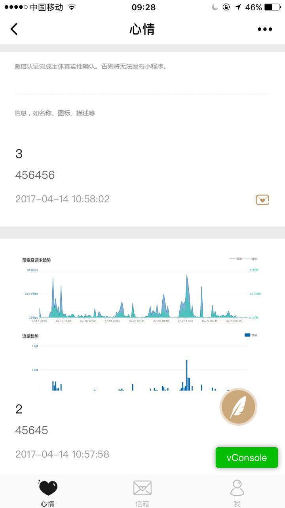
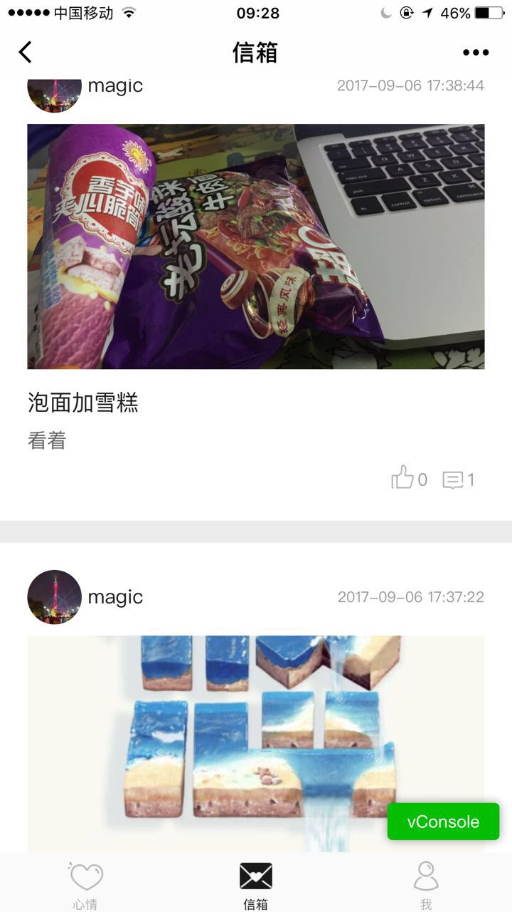
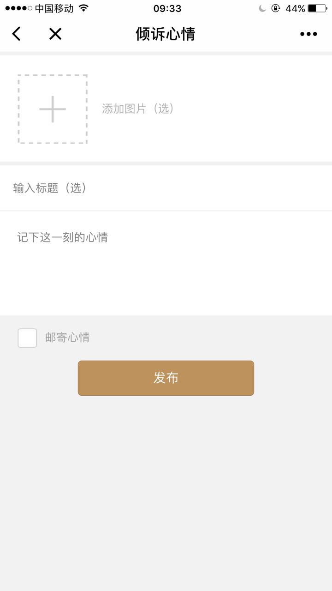
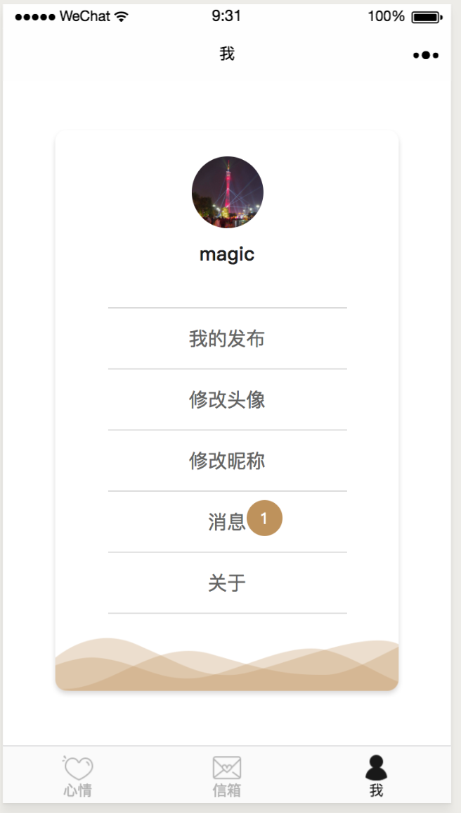

# Bmob-wechatApp-xinyou

##线上演示

> 此代码与线上有细微区别，功能与线上基本一致，线上代码基于PHP+MYSQL开发。

#### <i class="icon-file"></i> 版本 v0.2.0
> **Note:**

> - 修复邮箱刷新闪屏问题
> - 优化appid不显示数据问题
> - 增加消息功能
> - 增加评论提醒功能，增加评论表
> - 增加我发布功能

----------

#### <i class="icon-file"></i> 版本 v0.1.1
> **Note:**

> - 第一个版本，实现邮箱功能

----------

小程序名称为心邮，这是一款发布日志和心情的小程序。用来倾诉烦恼、分享快乐。
使用步骤：
####第一步：创建项目，记得填入你自己的AppId(必须填入AppId，不然无法调用wx.login())。
####第二步：下载该demo。
####第三步：在微信小程序管理后台中配置服务器域名为https://api.bmob.cn。
####第四步：在Bmob后台创建应用，将你的AppID(小程序ID)和AppSecret(小程序密钥)填写到Bmob的微信小程序配置密钥中。
####第五步：将你的Application ID和REST API Key替换app.js中的Bmob.initialize("e3cecf75da3d8316729ee905e81f5ac1", "adf78f7709798f97d6bb9aef6a7624ad")。
####第六步：创建表和字段：
####(1)在_User表中新建字段userPic(String),nickname(String)
####(2)新建Diary表，新建字段title(String),publisher(Pointer)<关联_User表>,pic(File),likeNum(Number),is_hide(String),content(String),commentNum(Number),liker(Array)
####(3)新建Comments表，新建字段publisher(Pointer)<关联_User表>,olderUserName(String),olderComment(Pointer)<关联Comments表>,mood(Pointer)<关联Diary表>,content(String)
####（4）、v0.2.0 增加评论表  avatar，behavior（int），fid 文章发布者，is_read(int)，uid(Pointer)用户表 评论用户id，username，wid //文章id

> 目前系统支持自动创建库与表，可在项目交易找到心邮。

---

##注意事项

> - 1.心邮代码之前是用Bmob老版本SDK开发， 微信所有授权域名统一填写`api.bmob.cn`

##项目截图

如有疑问或建议，请加Q群118541934 联系管理员